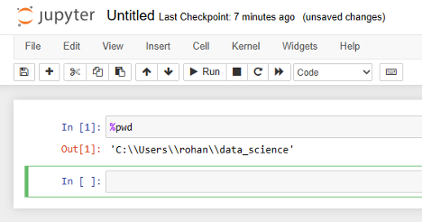

::::::::::::::::::::::::::::::::::::::: objectives

- Download and install Python.
- Install the JupyterLab and Pandas packages.
- Learn about folders and files on your computer.
- Create a folder for the Jupyter notebooks you will create during this workshop series.

::::::::::::::::::::::::::::::::::::::::::::::::::

:::::::::::::::::::::::::::::::::::::::: questions

- How do I install Python?
- How do I launch Jupyter Lab?

::::::::::::::::::::::::::::::::::::::::::::::::::

## Getting Started with Python

In this activity, you will install Python to your personal computer. 
You only need to install and configure Python once for this workshop, so future lessons will assume that you already have Python installed.

[Jupyter Lab](https://jupyterlab.readthedocs.io/en/latest/) is a special Python library with an integrated web user interface from [Project Jupyter][jupyter] that
enables one to work with documents and activities such as Jupyter notebooks, text editors, terminals,
and even custom components in a flexible, integrated, and extensible manner.

## Jupyter Notebooks

Jupyter notebooks are common in data science and visualization and serve as a convenient common-denominator experience for running Python code interactively where we can easily view and share the results of our Python code.

There are other ways of editing, managing, and running code, but Jupyter notebooks 
let us execute and view the results of our Python code immediately within the notebook.

## Installing Python
The easiest way to install Python and JupyterLab will depend on your operating system.

- **If you have a Mac laptop, [click here](#installing-python-macos).**
- **If you have a Windows laptop, [click here](#installing-python-windows).**

## Installing Python: MacOS

Before installing Python on a Mac, you will need to know the [type of processor](https://support.apple.com/en-us/116943) it has. 

Depending on when you bought your laptop, your Mac may have an Apple Silicon chip
or an Intel Chip. For Python to work correctly, you must install the version that corresponds to your laptop's chip.

### Finding Your Processor Chip Type

1. Click on the Apple icon in the top left corner of your screen.
2. Select *About this Mac*.
3. Look at the line labeled *Chip*.
  - If your chip name begins with Apple, it is an Apple Silicon processor.
  - If your chip name begins with Intel, it is an Intel processor.

   

### Downloading Python
To make installation faster and easier, you will be downloading
Python through environment management tool called Miniconda. 

[Go to the **Anaconda/Miniconda** download page.](https://www.anaconda.com/download/success).

   

From the **Miniconda** column, select the **Graphical installer** download that corresponds to your chip type.

For example, if you have a Mac with an Apple Silicon chip, you should select the *64-Bit (Apple silicon) Graphical
Installer*.

Double-click to download the file to your computer. 

### Installing Miniconda

Once the download has completed, double-click the Miniconda *.pkg* file in your Downloads folder.

An graphical installer will launch.

   

Press *Continue* to nagivate through the installer. Click *Agree* to the terms of the End User License Agreement. 

When prompted to select a destination for your Python installation, select "Install for all users of this computer".

This will install Miniconda (and Python) to the `/opt/bin/miniconda` folder. Click *Continue*.

   

When prompted, click *Install*.

   

Wait while Miniconda installs. This should take fewer than 5 minutes.

   

When the installation has finished, close the installer window by clicking *Close*.

### Installing Jupyter Lab

Look for the magnifying glass icon in the top right corner of your screen.
Search for *Terminal* and click the icon to launch the Terminal application.

   

The Terminal (or command line) is a special application that allows you to talk to software on your computer through textual commands.
Some applications can *only* be accessed through the command line. 

   

Type the command `pip install jupyterlab pandas` and press the
Enter key.

   

When the installation has finished, you will see a message like one above. You will see your username followed by
a blinking cursor, which means that the terminal
is waiting for another command.

### Launching Jupyter Lab

   

Congratulations! You've installed Jupyter Lab. You will not
need to perform these installation steps again.

In the future you can launch Juptyer Lab by doing the following:

1. Search for *Terminal*.
2. Open *Terminal*.
3. Type `jupyter lab` inside the terminal and press the Enter key.

JupyterLab will launch in a new tab in your default web browser.

   

After everyone has installed Jupyter Lab, we will talk about 
how to create, edit, and save Python projects.

## Installing JupyterLab Desktop: Windows

### Downloading Python for Windows
To make installation faster and easier, you will be downloading
Python through environment management tool called Miniconda. 

   

Click to download the file to your computer.  

### Installing Minconda
Locate the downloaded file (it will often go to your Downloads folder by default) 
to start the installation process. Double-click it.

You will see a launcher like this open.

   

Click *Next* to proceed to the next screen of the installer.

Read through Miniconda’s End User License Agreement (EULA) and click *I Agree* to agree to the terms. 

You will be prompted to select for which users Miniconda should be installed, either
  * Just Me (Recommended)
  * All Users 

   

Select *Just Me* and click *Next*.

Next, you will be prompted to select where Miniconda should be installed. The default location, in your
home directory, is appropriate.

   

When asked about *Advanced Installation Options* make sure to check:
* Create shortcuts
* Register Miniconda3 as my default Python 3.13

Leave the other boxes unchecked.

   

Click *Install* to install Miniconda. This should take no more than five minutes.

   

When the application has finished installing, click *Next*.

   

You will reach a final screen. Uncheck both boxes (you can read up on Miniconda later) and click *Finish*.

### Installing Jupyter Lab

Click the symbol on the bottom of your screen or press the <kbd>Windows ⊞</kbd> key on your keyboard. This
will open up the Windows Start Menu.

In the Search box, type *Anaconda Prompt*. You should see a result like this:

  

Click *Pin to taskbar*, as you'll need this later.

Now, click on the *Anaconda Prompt* icon. A black screen with a flashing character will open

Inside the prompt window, type `pip install pandas jupyterlab` and press the <kbd>Enter</kbd> key.

The packages required for this workshop will install.

After the installation finishes, the cursor will flash again. Congratulations, you have
installed Python and Jupyter Lab!

### Launching Jupyter Lab

Congratulations! You've installed Jupyter Lab. You will not
need to perform these installation steps again.

In the future you can launch Juptyer Lab by doing the following:

2. Open *Anaconda Prompt*.
3. Type `jupyter lab` inside the terminal and press the Enter key.

   

JupyterLab will launch in a new tab in your default web browser.

   

After everyone has installed Jupyter Lab, we will talk about 
how to create, edit, and save Python projects.

## The JupyterLab Interface

JupyterLab has many features found in traditional integrated development environments (IDEs) but
is focused on providing flexible building blocks for interactive, exploratory computing.

The [JupyterLab Interface](https://jupyterlab.readthedocs.io/en/4.4.x/user/interface.html)
consists of the Menu Bar, a collapsable Left Side Bar, and the Main Work Area which contains tabs
of documents and activities.

### Menu Bar

The Menu Bar at the top of JupyterLab has the top-level menus that expose various actions
available in JupyterLab along with their keyboard shortcuts (where applicable). 

A screenshot of the default Menu Bar is provided below.

   

### Main Work Area

The main work area in JupyterLab enables you to arrange documents (notebooks, text files, etc.)
and other activities (terminals, code consoles, etc.) into panels of tabs that can be resized or
subdivided. A screenshot of the default Main Work Area is provided below.

If you do not see the Launcher tab, click the blue plus sign under the "File" and "Edit" menus and it will appear.

   

### Left Sidebar

The left sidebar contains a number of commonly used tabs. Most importantly for us, it has a file browser (showing the
contents of the directory where the JupyterLab server was launched). The directory where the JupyterLab server was launched will function as your working directory. This matters because if you want to reference other data files in your code, JupyterLab will look for them here by default. A screenshot of
the default Left Side Bar is provided below.

   

The left sidebar can be collapsed or expanded by selecting "Show Left Sidebar" in the View menu or
by clicking on the active sidebar tab.

On Macs, the file browser displays automatically, but on Windows this file browser view is often hidden by default. We recommend that you turn it on using the following steps.

Step 1: Click on view in the menu bar. This opens a drop down menu of options. 	Select “File Browser”  

   

 
Step 2: When you click on File Browser, this will open up the file directory as shown above.  

:::::::::::::::::::::::::::::::::::::::::  callout

## What is a Working Directory?

- A working directory (or current working directory) is the current folder or location on a computer's file system where a program or process is operating by default. 
- The working directory is the default location where Python will look for files you want to load and where it will put any files you save.
- You will write your code in Jupyter Notebooks, and save them for later in a folder. Jupyter Notebooks are file type that ends in `.ipynb`.
- It's a good idea to save your code files in the same folder where you save any data files that you want to analyze. In this workshop your data files will be in the open source spreadsheet format `.csv`. 
  
::::::::::::::::::::::::::::::::::::::::::::::::::

## Create and save a Jupyter Notebook file to your Working Directory

Now that JupyterLab is reopened, click on Python 3 in the Launcher to create a new Jupyter Notebook: 

   

Use the menu or save icon to save this blank notebook. Make sure to name it something helpful\! For example, `PythonWorkshop` or `PythonDay1`. Notice that JupyterLab will append `.ipynb` to the end of the name of the notebook. This is the file extension for Jupyter Notebooks.

In the future, you can open to this working directory by any of the following:

* Double click in finder to open this file.  
* Open JupyterLab Desktop, and from the Start screen click on the relevant item in the Recent sessions list to restore this session.

   

## Verify your Working Directory

You can verify that you have the correct working directory by using what's called a *magic* command. Use the %pwd magic command within a code cell to print the current working directory. The output will display the current directory path.

   

  
This magic command passes the "print working directory" command to your computer. [Learn more about pwd here](https://superbasics.beholder.uk/command-line/example-pwd/) ([https://superbasics.beholder.uk/command-line/example-pwd/](https://superbasics.beholder.uk/command-line/example-pwd/)).

:::::::::::::::::::::::::::::::::::::::: keypoints

- JupyterLab is an application for running files for managing and organizing Python
code called Jupyter notebooks.
- You will only need to install JupyterLab once for this workshop.
- Your current working directory determines where programs are run and how
filepaths are interpreted.

::::::::::::::::::::::::::::::::::::::::::::::::::