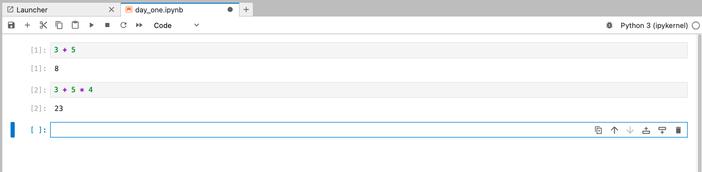
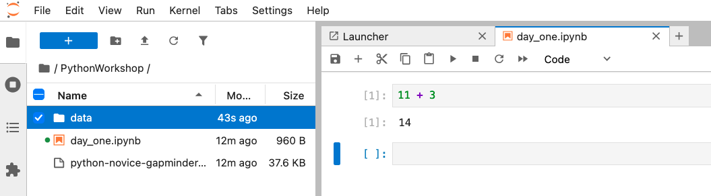
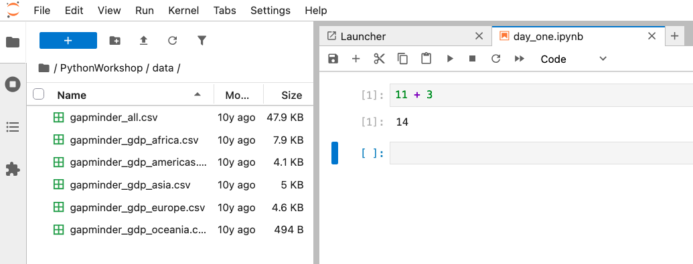

::::::::::::::::::::::::::::::::::::::: objectives

- Launch JupyterLab.
- Create a Jupyter notebook.
- Shutdown the JupyterLab server.
- Create Markdown cells in a notebook.
- Create and run Python cells in a notebook.
- Distinguish between Markdown cells and Python cells.

::::::::::::::::::::::::::::::::::::::::::::::::::

:::::::::::::::::::::::::::::::::::::::: questions

- How can I run Python programs?

::::::::::::::::::::::::::::::::::::::::::::::::::


## Getting Started with JupyterLab

We going to use Jupyter Notebooks via JupyterLab for the remainder of this workshop.

JupyterLab has several useful features for Python programmers:

* You can easily type, edit, and copy/paste blocks of code.
* Tab complete allows you to easily access the names of things you are using and learn more about them.
* You can annotate your code with links, different sized text, bullets, etc. to make it more accessible to you and your collaborators.
* It allows you to display visualizations next to the code that produces them to tell stories about data.

## Starting JupyterLab

You can start the JupyterLab server through the command line via the Terminal (Mac) or 
via `Anaconda Prompt` (Windows). Anaconda Prompt is included as part of the Miniconda Python distribution you have installed.
Remember that you cannot open Jupyter notebooks (`.ipynb` files) by clicking on them directly. 
Instead, you will need to open JupyterLab and open your notebooks using the JupyterLab *File Browser*.

### macOS - Command Line

To start the JupyterLab server you will need to access the command line through the Terminal.

There are two ways to open Terminal on Mac.

1. In your Applications folder, open Utilities and double-click on Terminal
2. Press <kbd>Command</kbd> + <kbd>spacebar</kbd> to launch Spotlight. Type `Terminal` and then
  double-click the search result or hit <kbd>Enter</kbd>

After you have launched Terminal, type the command to launch the JupyterLab server.

```bash
$ jupyter lab
```

### Windows Users - Command Line

To start the JupyterLab server you will need to access the Anaconda Prompt.

Press <kbd>Windows Logo Key</kbd> and search for `Anaconda Prompt`, click the result or press enter.

After you have launched the Anaconda Prompt, type the command:

```bash
$ jupyter lab
```

## The JupyterLab Interface

JupyterLab has many features found in traditional integrated development environments (IDEs) but
is focused on providing flexible building blocks for interactive, exploratory computing.

The [JupyterLab Interface][jupyterlab-ui]
consists of the Menu Bar, a collapsable Left Side Bar, and the Main Work Area which contains tabs
of documents and activities.

### Menu Bar

The Menu Bar at the top of JupyterLab has the top-level menus that expose various actions
available in JupyterLab along with their keyboard shortcuts (where applicable). The following
menus are included by default.

- **File:** Actions related to files and directories such as *New*, *Open*, *Close*, *Save*, etc. The *File* menu also includes the *Shut Down* action used to shutdown the JupyterLab server.
- **Edit:** Actions related to editing documents and other activities such as *Undo*, *Cut*, *Copy*, *Paste*, etc.
- **View:** Actions that alter the appearance of JupyterLab.
- **Run:** Actions for running code in different activities such as notebooks and code consoles (discussed below).
- **Kernel:** Actions for managing kernels. Kernels in Jupyter will be explained in more detail below.
- **Tabs:** A list of the open documents and activities in the main work area.
- **Settings:** Common JupyterLab settings can be configured using this menu. There is also an *Advanced Settings Editor* option in the dropdown menu that provides more fine-grained control of JupyterLab settings and configuration options.
- **Help:** A list of JupyterLab and kernel help links.

:::::::::::::::::::::::::::::::::::::::::  callout

## Kernels

The JupyterLab [docs](https://jupyterlab.readthedocs.io/en/stable/user/documents_kernels.html)
define kernels as "separate processes started by the server that runs your code in different programming languages and environments."
When we open a Jupyter Notebook, that starts a kernel - a process - that is going to run the code.

In this lesson, we'll be using the Jupyter ipython kernel which lets us run Python 3 code interactively.

Using other Jupyter [kernels for other programming languages](https://github.com/jupyter/jupyter/wiki/Jupyter-kernels) would let us
write and execute code in other programming languages in the same JupyterLab interface, like R, Java, Julia or Ruby.

::::::::::::::::::::::::::::::::::::::::::::::::::

A screenshot of the default Menu Bar is provided below.

<p align='center'>   
</p>

### Left Sidebar

The left sidebar contains a number of commonly used tabs, such as a file browser (showing the
contents of the directory where the JupyterLab server was launched), a list of running kernels
and terminals, the command palette, and a list of open tabs in the main work area. A screenshot of
the default Left Side Bar is provided below.

<p align='center'>   
</p>

The left sidebar can be collapsed or expanded by selecting "Show Left Sidebar" in the View menu or
by clicking on the active sidebar tab.

### Main Work Area

The main work area in JupyterLab enables you to arrange documents (notebooks, text files, etc.)
and other activities (terminals, code consoles, etc.) into panels of tabs that can be resized or
subdivided. A screenshot of the default Main Work Area is provided below.

If you do not see the Launcher tab, click the blue plus sign under the "File" and "Edit" menus and it will appear.

<p align='center'>   
</p>

Drag a tab to the center of a tab panel to move the tab to the panel. Subdivide a tab panel by
dragging a tab to the left, right, top, or bottom of the panel. The work area has a single current
activity. The tab for the current activity is marked with a colored top border (blue by default).

## Creating a Jupyter Notebook

To open a new notebook click the Python 3 icon under the *Notebook* header in the Launcher tab in
the main work area. You can also create a new notebook by selecting *New -> Notebook* from the *File* menu in the Menu Bar.

Additional notes on Jupyter notebooks.

- Notebook files have the extension `.ipynb` to distinguish them from plain-text Python programs.
- Notebooks can be exported as Python scripts that can be run from the command line.

Below is a screenshot of a Jupyter notebook running inside JupyterLab. If you are interested in
more details, then see the [official notebook documentation][jupyterlab-notebook-docs].

<p align='center'>   
</p>

:::::::::::::::::::::::::::::::::::::::::  callout

## How It's Stored

- The notebook file is stored in a format called JSON.
- Just like a webpage, what's saved looks different from what you see in your browser.
- But this format allows Jupyter to mix source code, text, and images, all in one file.
  

::::::::::::::::::::::::::::::::::::::::::::::::::

:::::::::::::::::::::::::::::::::::::::  challenge

## Arranging Documents into Panels of Tabs

In the JupyterLab Main Work Area you can arrange documents into panels of tabs. Here is an
example from the [official documentation][jupyterlab].

<p align='center'>   
</p>

Use the Launcher to create a new text file called README.txt. Open your notebook, File Browser tab, and text file and
arrange them into three panels in the main work area. What combination of panels and tabs do you think will be most useful for your
workflow?

:::::::::::::::  solution

## Solution

After creating the necessary tabs, you can drag one of the tabs to the center of a panel to
move the tab to the panel; next you can subdivide a tab panel by dragging a tab to the left,
right, top, or bottom of the panel.


:::::::::::::::::::::::::

::::::::::::::::::::::::::::::::::::::::::::::::::

:::::::::::::::::::::::::::::::::::::::::  callout

## Code vs. Text

Jupyter mixes code and text in different types of blocks, called cells. We use the term "code" to mean "code written in a language like Python."
* In this class, a "code cell" will always contain Python.
* A "text cell" is one that contains ordinary prose written for human beings.

::::::::::::::::::::::::::::::::::::::::::::::::::


## Python As a Calculator

Python can be used as a calculator to perform basic mathematical operations like multiplication and addition.

<p align='center'>   
</p>


Create a new cell in your Jupyter notebook. Make sure it is a "Code" cell. Type the following and press the ▶ *Play Button* or <kbd>Shift</kbd>+<kbd>Enter</kbd> on your keyboard to run your code.

```python
3 + 5
```

```output
8
```

Python "knows" order of operations, so multiplication is applied before division. Run the following calculation in a new cell underneath the first one.

```python
3 + 5 * 4
```

```output
23
```

:::::::::::::::::::::::::::::::::::::::  challenge

## Negative Numbers?

You can use parentheses in mathematical expressions in Python. Statements in parentheses are always evaluated first.

Adjust the following code by inserting parentheses so that it returns a *negative number* as a result. Do not change anything else about the code.

```python
10 * 3 - 5
```

Remember to run the code cell to check your work.

:::::::::::::::  solution

## Solution

By default, multiplication is evaluated before subtraction. Insert parentheses around `3 - 5` so that 10 is multiplied by `-2` instead.

```python
10 * (3 - 5)
```

```output
-20
```
:::::::::::::::::::::::::

::::::::::::::::::::::::::::::::::::::::::::::::::

## The Notebook has Command and Edit modes.

- If you press <kbd>Esc</kbd> and <kbd>Return</kbd> alternately, the outer border of your code cell will change from gray to blue.
- These are the **Command** (gray) and **Edit** (blue) modes of your notebook.
- Command mode allows you to edit notebook-level features, and Edit mode changes the content of cells.
- When in Command mode (esc/gray),
  - The <kbd>b</kbd> key will make a new cell below the currently selected cell.
  - The <kbd>a</kbd> key will make one above.
  - The <kbd>x</kbd> key will delete the current cell.
  - The <kbd>z</kbd> key will undo your last cell operation (which could be a deletion, creation, etc).
- All actions can be done using the menus, but there are lots of keyboard shortcuts to speed things up.

:::::::::::::::::::::::::::::::::::::::  challenge

## Command Vs. Edit

* In the Jupyter notebook page are you currently in Command or Edit mode?  
* Switch between the modes.
* Use the shortcuts to generate a new cell.
* Use the shortcuts to delete a cell.
* Use the shortcuts to undo the last cell operation you performed.

:::::::::::::::  solution

## Solution

Command mode has a grey border and Edit mode has a blue border.
Use <kbd>Esc</kbd> and <kbd>Return</kbd> to switch between modes.
You need to be in Command mode (Press <kbd>Esc</kbd> if your cell is blue).  Type <kbd>b</kbd> or <kbd>a</kbd>.
You need to be in Command mode (Press <kbd>Esc</kbd> if your cell is blue).  Type <kbd>x</kbd>.
You need to be in Command mode (Press <kbd>Esc</kbd> if your cell is blue).  Type <kbd>z</kbd>.


:::::::::::::::::::::::::

::::::::::::::::::::::::::::::::::::::::::::::::::

### Use the keyboard and mouse to select and edit cells.

- Pressing the <kbd>Return</kbd> key turns the border blue and engages Edit mode, which allows
  you to type within the cell.
- Because we want to be able to write many lines of code in a single cell,
  pressing the <kbd>Return</kbd> key when in Edit mode (blue) moves the cursor to the next line
  in the cell just like in a text editor.
- We need some other way to tell the Notebook we want to run what's in the cell.
- Pressing <kbd>Shift</kbd>\+<kbd>Return</kbd> together will execute the contents of the cell.
- Notice that the <kbd>Return</kbd> and <kbd>Shift</kbd> keys on the right of the keyboard are
  right next to each other.

### The Notebook will turn Markdown into pretty-printed documentation.

- Notebooks can also render [Markdown][markdown].
  - A simple plain-text format for writing lists, links,
    and other things that might go into a web page.
  - Equivalently, a subset of HTML that looks like what you'd send in an old-fashioned email.
- Turn the current cell into a Markdown cell by entering the Command mode (<kbd>Esc</kbd>/gray)
  and press the <kbd>M</kbd> key.
- `In [ ]:` will disappear to show it is no longer a code cell and you will be able to write in
  Markdown.
- Turn the current cell into a Code cell by entering the Command mode (<kbd>Esc</kbd>/gray) and
  press the <kbd>y</kbd> key.

### Markdown allows you to "style" text cells.

Table: Showing some markdown syntax and its rendered output.

+---------------------------------------+------------------------------------------------+
| Markdown code                         | Rendered output                                |
+=======================================+================================================+
+---------------------------------------+------------------------------------------------+
| ```                                   | <p></p>                                        |
| *   Use asterisks                     | -   Use asterisks                              |
| *   to create                         | -   to create                                  |
| *   bullet lists.                     | -   bullet lists.                              |
| ```                                   |                                                |
+---------------------------------------+------------------------------------------------+
+---------------------------------------+------------------------------------------------+
| ```                                   | <p></p>                                        |
| 1.   Use numbers                      | 1.   Use numbers                               |
| 1.   to create                        | 2.   to create                                 |
| 1.   bullet lists.                    | 3.   numbered lists.                           |
| ```                                   |                                                |
+---------------------------------------+------------------------------------------------+
+---------------------------------------+------------------------------------------------+
| ```                                   | <p></p>                                        |
| # A Level-1 Heading                   | ## A Level-1 Heading                           |
| ```                                   |                                                |
+---------------------------------------+------------------------------------------------+
+---------------------------------------+------------------------------------------------+
| ```                                   | <p></p>                                        |
| ## A Level-2 Heading (etc.)           | ### A Level-2 Heading (etc.)                   |
| ```                                   |                                                |
+---------------------------------------+------------------------------------------------+
+---------------------------------------+------------------------------------------------+
| ```                                   | <p></p>                                        |
| Line breaks                           | Line breaks                                    |
| don't matter.                         | don't matter.                                  |
|                                       |                                                |
| But blank lines                       | But blank lines                                |
| create new paragraphs.                | create new paragraphs.                         |
| ```                                   |                                                |
+---------------------------------------+------------------------------------------------+
+---------------------------------------+------------------------------------------------+
| ```                                   | <p></p>                                        |
| [Links](http://software-carpentry.org)| [Links](https://software-carpentry.org)        |
| are created with `[...](...)`.        | are created with `[...](...)`.                 |
| Or use [named links][data-carp].      | Or use [named links][data_carpentry].          |
|                                       |                                                |
| [data-carp]: http://datacarpentry.org |                                                |
| ```                                   |                                                |
+---------------------------------------+------------------------------------------------+

## Adding Data to Your Project Folder

:::::::::::::::::::::::::::::::::::::::: caution

Please do not leave the workshop today until you have a `PythonWorkshop` folder with a `data` folder inside.

::::::::::::::::::::::::::::::::::::::::::::::::::

The data we will be using for this project is taken from the [gapminder] dataset.

To add the data to your project, **download and unzip the file
[python-novice-gapminder-data.zip](files/python-novice-gapminder-data.zip)
 to your `PythonWorkshop` folder**.

<p align='center'>   
</p>

Double-click (MacOS) or right-click->*Extract All* the `python-novice-gapminder-data.zip` (Windows) file to extract a folder of data from the zip file. The unzipped folder will be named *data*.

Copy the *data* folder into your `PythonWorkshop` folder.

<p align='center'>   
</p>

Click the ⟳ refresh symbol in the JupyterLab File Browser, then click inside the `data` folder to inspect its
contents from within JupyterLab. You should see six files inside the `data` folder.


:::::::::::::::::::::::::::::::::::::::  challenge

## Creating Lists in Markdown

Create a list in a Markdown cell in a notebook that looks like this:

1. Get funding.
2. Do work.
3. Write up.
4. Publish.

:::::::::::::::  solution

## Solution

Your list should look like this.

```
1.  Get funding.
2.  Do work.
3.  Write up.
4.  Publish.
```

:::::::::::::::::::::::::

::::::::::::::::::::::::::::::::::::::::::::::::::

:::::::::::::::::::::::::::::::::::::::  challenge

## More Math

What is displayed when a Python cell in a notebook
that contains several calculations is executed?
For example, what happens when this cell is executed?

```python
7 * 3
2 + 1
```

:::::::::::::::  solution

## Solution

Python returns the output of the last calculation.

```python
3
```

:::::::::::::::::::::::::

::::::::::::::::::::::::::::::::::::::::::::::::::

:::::::::::::::::::::::::::::::::::::::  challenge

## Change an Existing Cell from Code to Markdown

What happens if you write some Python in a code cell
and then you switch it to a Markdown cell?
For example,
put the following in a code cell:

```python
x = 6 * 7 + 12
print(x)
```

And then run it with <kbd>Shift</kbd>\+<kbd>Return</kbd> to be sure that it works as a code cell.
Now go back to the cell and use <kbd>Esc</kbd> then <kbd>m</kbd> to switch the cell to Markdown
and "run" it with <kbd>Shift</kbd>\+<kbd>Return</kbd>.
What happened and how might this be useful?

:::::::::::::::  solution

## Solution

The Python code gets treated like Markdown text.
The lines appear as if they are part of one contiguous paragraph.
This could be useful to temporarily turn on and off cells in notebooks that get used for multiple purposes.

```python
x = 6 * 7 + 12 print(x)
```


:::::::::::::::::::::::::

::::::::::::::::::::::::::::::::::::::::::::::::::


[jupyterlab]: https://jupyterlab.readthedocs.io/en/stable/
[jupyterlab-ui]: https://jupyterlab.readthedocs.io/en/stable/user/interface.html
[jupyterlab-notebook-docs]: https://jupyterlab.readthedocs.io/en/stable/user/notebook.html
[markdown]: https://en.wikipedia.org/wiki/Markdown
[data_carpentry]: https://datacarpentry.org


:::::::::::::::::::::::::::::::::::::::: keypoints

- Use the JupyterLab Notebook interface for editing and running Python.
- Use the keyboard and mouse to select and edit cells.
- Jupyter Notebooks turn Markdown into pretty-printed documentation.
- Markdown can be used to format commentary on Python code.

::::::::::::::::::::::::::::::::::::::::::::::::::

[gapminder]: https://en.wikipedia.org/wiki/Gapminder_Foundation
